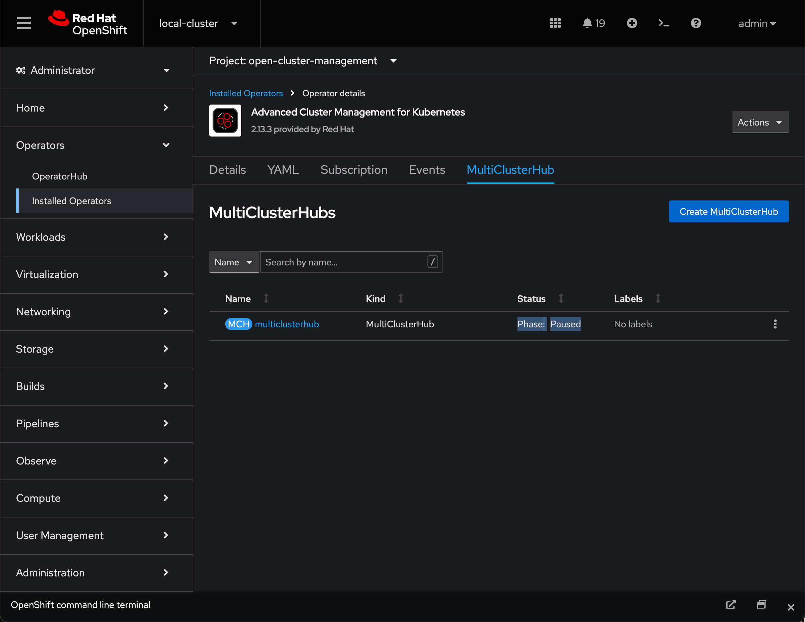

# Manual RHEM install procedure on OpenShift
## Description
Procedure to remove an existing ACM Operator installation of RHEM then install desired version of RHEM (not utilizing the ACM Operator)

## Steps
1. Disable any upper-level orchestration if present (e.g. ArgoCD: acm-rhem app | disable auto-sync)

2. Remove the RHEM installation from the ACM Operator
```
oc patch multiclusterhubs.operator.open-cluster-management.io multiclusterhub -n open-cluster-management --type json --patch '[{"op": "remove", "path":"/spec/overrides/components"}]'
```
3. Wait for the ConsolePlugin to refresh


4. Annotate the Multi Cluster Hub to pause so it does not attempt to reconcile RHEM (e.g. remove it)
```
oc annotate mce multiclusterengine pause=true --overwrite
```

```
oc annotate -n open-cluster-management `oc get mch -oname -n open-cluster-management | head -n1` mch-pause=true --overwrite=true
```



5. Confirm that MCH is in Phase: Paused
