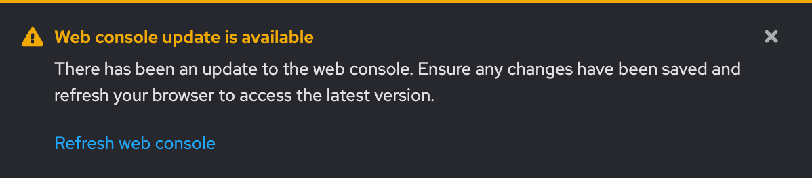

# Manual RHEM install procedure on OpenShift
## Description
Procedure to remove an existing ACM Operator installation of RHEM then install desired version of RHEM (not utilizing the ACM Operator)

## Remove RHEM
1. Disable any upper-level orchestration if present (e.g. ArgoCD: acm-rhem app | disable auto-sync)

2. Remove the RHEM installation from the ACM Operator
```
oc patch multiclusterhubs.operator.open-cluster-management.io multiclusterhub -n open-cluster-management --type json --patch '[{"op": "remove", "path":"/spec/overrides/components"}]'
```
3. Wait for the ConsolePlugin to refresh



4. Annotate the Multi Cluster Hub to pause so it does not attempt to reconcile RHEM (e.g. remove it)
```
oc annotate mce multiclusterengine pause=true --overwrite
```

```
oc annotate -n open-cluster-management `oc get mch -oname -n open-cluster-management | head -n1` mch-pause=true --overwrite=true
```
5. Confirm that MCH is in Phase: Paused


## Install Desired <a href="https://quay.io/repository/flightctl/flightctl-api" target="_blank">version</a> of RHEM

Note: storageClassName will need to be set to requisite value for installed to env; here, we use our common OCP on AWS storageClassName

```
helm upgrade --install --version=0.8.1 \
  --namespace flightctl --create-namespace flightctl oci://quay.io/flightctl/charts/flightctl \
  --values - <<EOF
global:
  target: "acm"
  storageClassName: "ocs-external-storagecluster-ceph-rbd"
  auth:
    insecureSkipTlsVerify: true
db:
  storage:
    size: "20Gi"
EOF
```

6. Wait for the ConsolePlugin to refresh


7. Confirm Edge Manager avilability


## Uninstall

1. Issue helm command
```
helm uninstall flightctl --namespace flightctl
```

```
oc delete namespace flightctl
```


Scratch (latest version)
```
helm upgrade --install --version=0.9.0-main-221-gbd706dd7 \
  --namespace flightctl --create-namespace flightctl oci://quay.io/flightctl/charts/flightctl \
  --values - <<EOF
global:
  target: "acm"
  storageClassName: "ocs-external-storagecluster-ceph-rbd"
  auth:
    insecureSkipTlsVerify: true
db:
  storage:
    size: "20Gi"
EOF
```
